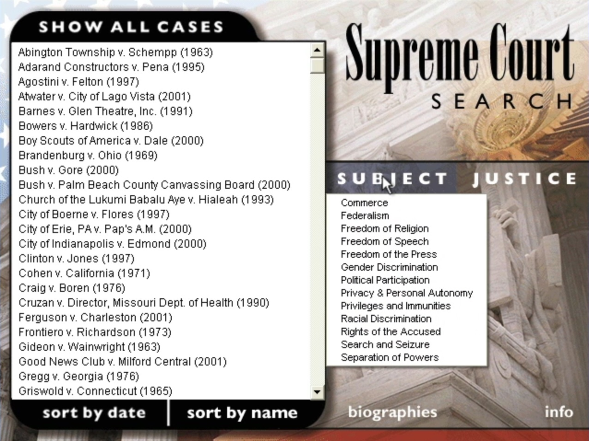

# The Supreme Court's Greatest Hits

This two-CD-ROM set, released in 2002 by Jerry Goldman, contained more than one hundred hours of Supreme Court oral arguments as well as opinion pronouncements from the bench, highlighting then-recent landmark cases such as [Bush v. Gore](/courts/ussc/?term=2000-10&case=00-949), [United States v. Morrison](/courts/ussc/?term=1999-10&case=99-5), and [Boy Scouts of America v. Dale](/courts/ussc/?term=1999-10&case=99-699). We have recreated the CD-ROM's **Subjects** by adding "SCGH" tags to each of the set's selected cases.

