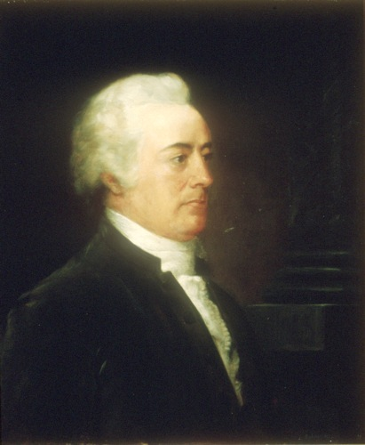

<h1>{{ page.title }}</h1>

Served from February 15, 1790 to March 5, 1791 and from August 12, 1795 to December 28, 1795.


Also argued {{ page.case_count }} case on {{ page.last_argument }}cases from {{ page.first_argument }} to {{ page.last_argument }}.


