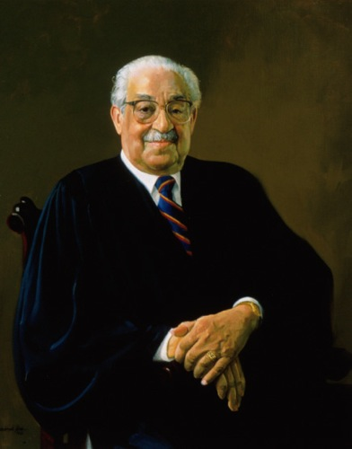

<h1>{{ page.title }}</h1>

Served from October 2, 1967 to October 1, 1991 ({{ page.years_served }} years).


Also argued {{ page.case_count }} case on {{ page.last_argument }}cases from {{ page.first_argument }} to {{ page.last_argument }}.


Wrote {{ page.opinions }} majority <a href="/courts/ussc/?collection=opinions&id={{ page.justice_id }}">opinions</a> and {{ page.lone_dissents }} lone <a href="/courts/ussc/?collection=lone_dissents&id={{ page.justice_id }}">dissents</a>, and spoke for {{ page.vocal_secs | divided_by: 3600.0 | round: 1 }} hours in <a href="/courts/ussc/?collection=vocal_justices&id={{ page.justice_id }}">oral arguments</a>Spoke for {{ page.vocal_secs | divided_by: 3600.0 | round: 1 }} hours in <a href="/courts/ussc/?collection=vocal_justices&id={{ page.justice_id }}">oral arguments</a>.


