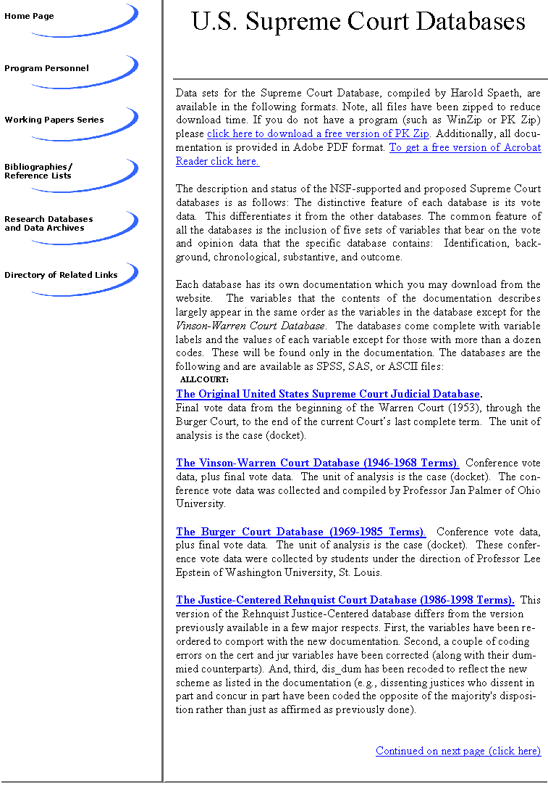

# [U.S. Supreme Court Databases](https://web.archive.org/web/20040211013007/http://polisci.msu.edu/pljp/sctdata1.html)

*Part of [The Program for Law and Judicial Politics](img/img0.gif), sponsored by Michigan State University Department of Political Science*

## ALLCOURT: Original United States Supreme Court Database (1953-2002 Terms) Updated: December 11, 2003

  - [SPSS File](allcourt/sctspss.zip) (formatted as a SPSS portable file)
  - [STATA File](allcourt/sctdta.zip) (formatted as a .dta file) NEW
  - [SAS File](allcourt/sctsas.zip) (formatted as a SAS transport file)
  - [ASCII File](allcourt/sctasc.zip) (formatted as a fixed ASCII dat file)
  - [Documentation](allcourt/sctcode.pdf) (in pdf format; updated November 25, 2003)
  - Documentation (in Word format; updated September 25, 2003) NEW
  - "[Becoming an Intelligent User of the Spaeth Databases.](allcourt/benesh_handout.pdf)" Presented by Sara C. Benesh at the 2002 Southwestern Political Science Association Meeting

## Vinson-Warren Court Database (1946-1968 Terms) Updated: September 25, 2002

  - SPSS File (formatted as a SPSS portable file)
  - SAS File (formatted as a SAS transport file)
  - ASCII File (formatted as a fixed ASCII dat file)
  - [Documentation](vinson-warren/vwcodebk.pdf) (in pdf format, updated September 25, 2002)
  - "[Becoming an Intelligent User of the Spaeth Databases.](allcourt/benesh_handout.pdf)" Presented by Sara C. Benesh at the 2002 Southwestern Political Science Association Meeting

